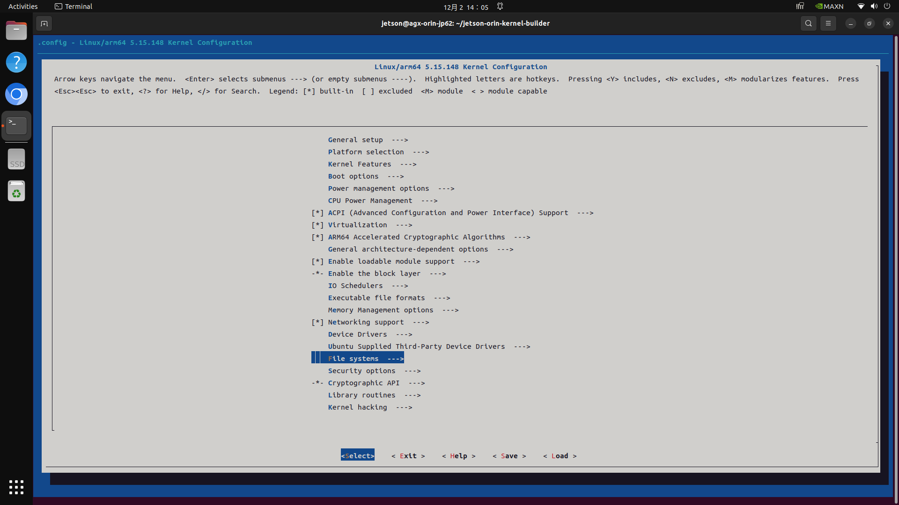
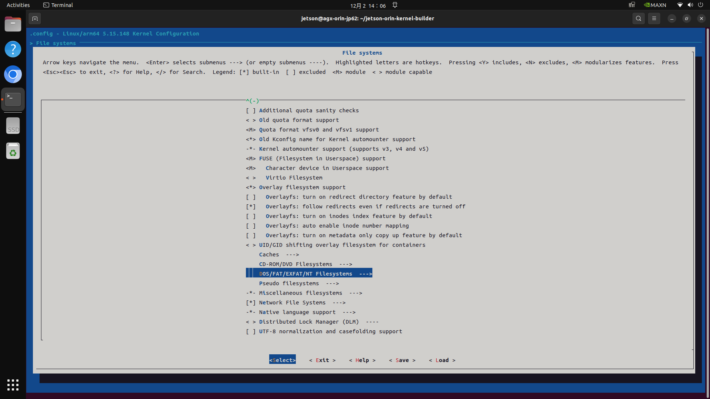
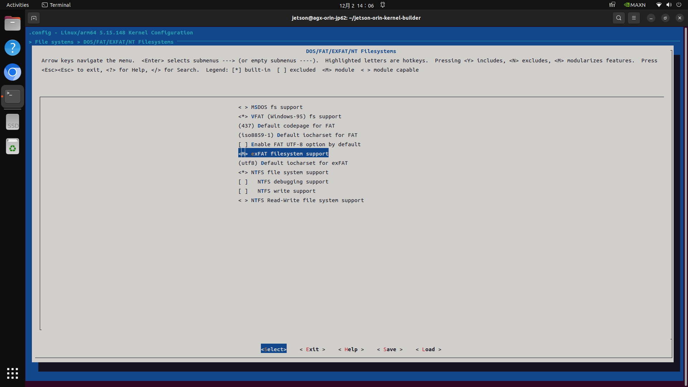

# jetson-orin-exfat-module-prebuild

## For English, please refer to [README.md](README.md)

為 Jetson Orin 預建的 exFAT 檔案系統核心模組

建置於 Jetson AGX Orin Developer Kit (Jetpack 6.2.1 / L4T 36.4.4)

已在 Jetson AGX Orin Developer Kit 和 Orin Nano Developer Kits (Jetpack 6.2.1 / L4T 36.4.4) 上測試可用

目前預建的檔案僅適用於 Jetpack 6.2.1 (L4T 36.4.4)

## 如何安裝預建模組

1. 複製此儲存庫

    ```bash
    git clone https://github.com/cavedutzushian/jetson-orin-exfat-module-prebuild.git
    ```

2. 執行安裝腳本

    此腳本會將預建的 exFAT 核心模組複製到 `/lib/modules/5.15.148-tegra/kernel/fs/exfat/` 目錄，並更新模組相依性。

    ```bash
    cd jetson-orin-exfat-module-prebuild
    ./install_exfat_module.sh
    ```

3. 享受您的 exFAT 檔案系統支援！

## 如何自行建置模組

目前（2025/12/02）為 Jetson Orin 建置核心模組最簡單的方法，是使用 [jetsonhacks/jetson-orin-kernel-builder](https://github.com/jetsonhacks/jetson-orin-kernel-builder)。它將核心原始碼下載、設定和建置過程整合到腳本中。

1. 複製 [jetsonhacks/jetson-orin-kernel-builder](https://github.com/jetsonhacks/jetson-orin-kernel-builder) 儲存庫

    ```bash
    git clone https://github.com/jetsonhacks/jetson-orin-kernel-builder.git 
    ```

2. 使用腳本下載核心原始碼

    ```bash
    cd jetson-orin-kernel-builder
    ./scripts/get_kernel_source.sh
    ```

3. 使用腳本編輯核心設定以啟用 exFAT 模組

    ```bash
    ./scripts/edit_config_cli.sh
    ```

    此命令將開啟一個 CLI 介面。 
   
    若要支援 exFAT，請導航至 `File systems` -> `DOS/FAT/EXFAT/NT Filesystems` -> `exFAT filesystem support`，並將其設為 `<M>` 以作為模組建置。然後儲存並退出。

    
    
    

4. 建置核心模組

    ```bash
    ./scripts/make_kernel_modules.sh
    ```

    如果您只想為此機器建置 exFAT 模組，您可以在建置完成後，直接按照腳本指示安裝。

5. （如有需要）複製建置好的模組

    建置好的模組可以在 `/usr/src/kernel/kernel-jammy-src/` 資料夾中找到。您可以在 `/usr/src/kernel/kernel-jammy-src/fs/exfat/exfat.ko` 找到 exFAT 模組。